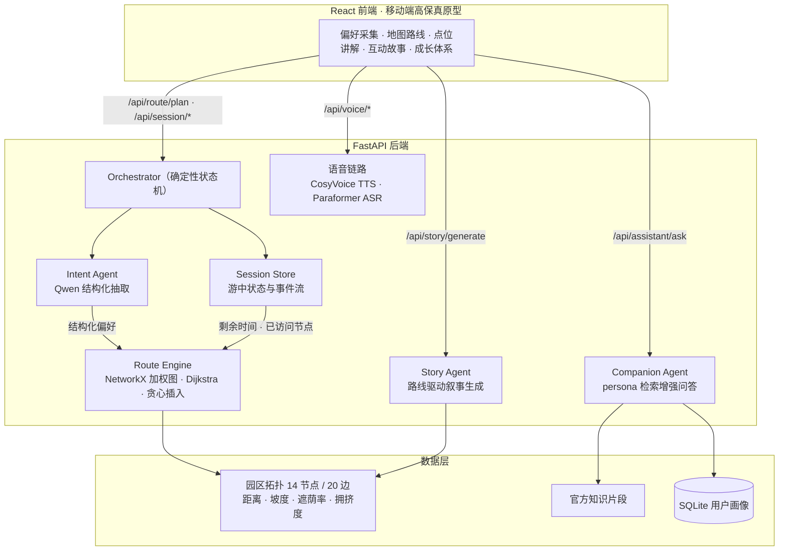
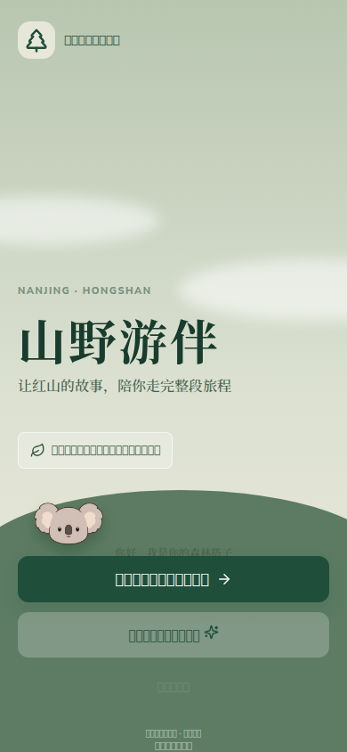
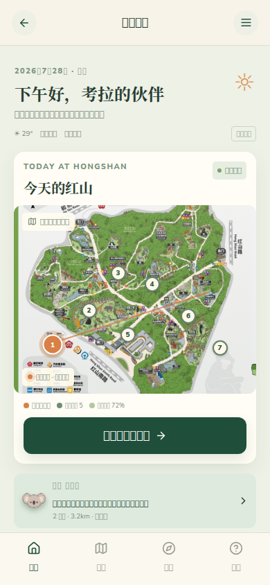
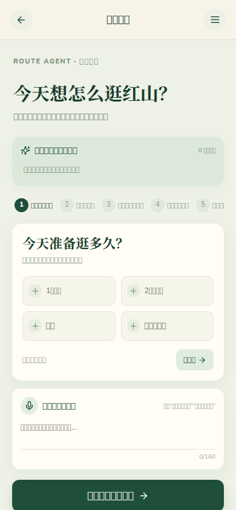
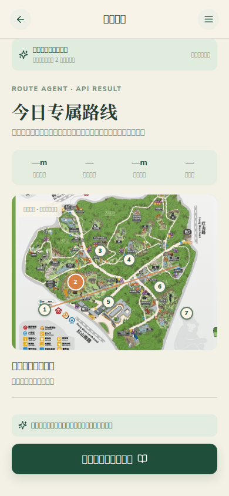
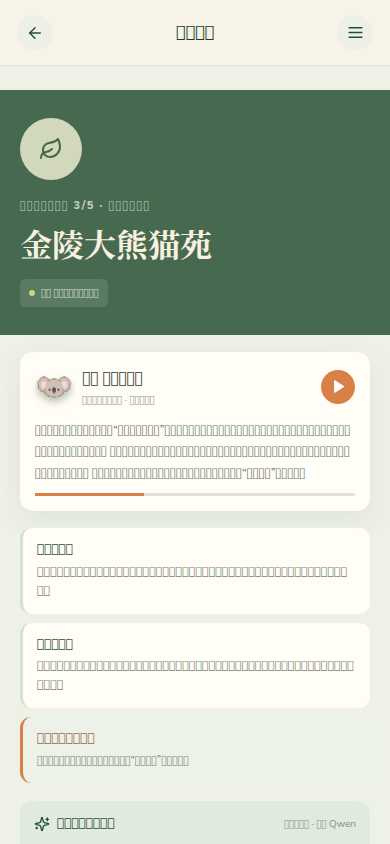
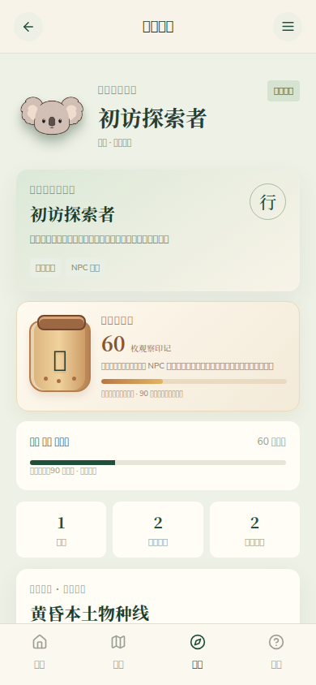

# 山野游伴 · 动物园智能游伴 Agent

[](https://www.python.org/)
[](https://fastapi.tiangolo.com/)
[](https://react.dev/)
[](https://www.aliyun.com/product/bailian)
[](backend/tests)

以南京红山森林动物园为场景的**游前规划—游中动态调整**闭环 Agent 系统：自然语言说需求，Agent 在园区拓扑图上计算约束路线，游途中响应"累了 / 饿了 / 太挤了"等事件实时调整剩余行程。

> **核心设计主张：不让大模型编造路线。**
> LLM 只负责它擅长的两件事——理解（自然语言 → 结构化需求）与表达（结果解释、讲解、叙事）；
> 流程调度由确定性 Orchestrator 状态机完成，路线由图算法在加权拓扑上计算。
> 每一层都有校验与降级，拔掉 API Key 系统照样能跑。

## 架构



## 它能做什么

| 能力 | 说明 |
|---|---|
| 游前动态路线规划 | "带着 3 岁孩子、只有 2 小时、怕晒、不想爬山、想看灵长类" → 约束内的场馆顺序、每站停留时间、总里程、可解释推荐理由；输出省力 / 兴趣 / 平衡三种方案 |
| 游中动态调整 | 疲劳、饥饿、提前离园、拥堵、动物活跃等 8 类事件触发**剩余路线局部重规划**，固定已访问节点；拥堵场景生成"等待 / 就近替代 / 跳过"选项交还用户决策 |
| 点位讲解与问答 | 4 套差异化 persona 游伴，官方知识片段检索注入 + Qwen 生成 + 本地兜底；支持语音提问（ASR）与朗读（TTS） |
| 路线驱动故事生成 | 故事章节数与路线节点数强制绑定、章节归属由后端覆写——模型负责写内容，节点归属由引擎决定，防止虚构场馆 |
| 全链路降级 | Qwen → 规则解析、百炼问答 → 本地知识库、TTS → 浏览器合成；每个 LLM 依赖点都有 fallback |

## 快速开始

```bash
# 1. 后端（Python 3.12+）
cd backend
python -m pip install -r requirements.txt
cp .env.example .env          # 填入你的 DASHSCOPE_API_KEY（不填则自动走离线降级）
python -m uvicorn app.main:app --host 127.0.0.1 --port 8765

# 2. 前端（另开终端）
npm install
npm run dev
```

打开 Vite 输出的地址即可。后端不可达时前端自动切换本地演示流程，不需要任何 Key。

## API 一览

| 接口 | 作用 |
|---|---|
| `POST /api/route/plan` | 自然语言 + 表单偏好 → 结构化意图 + 路线方案 |
| `POST /api/session/start` | 创建游中 Session |
| `POST /api/session/event` | 上报疲劳 / 饥饿 / 拥堵等 8 类事件 → 局部重规划 |
| `POST /api/route/replan` | 按剩余时间重算剩余路线 |
| `POST /api/assistant/ask` | persona 化游伴问答（RAG + 兜底） |
| `POST /api/story/generate` | 路线驱动的互动故事生成 |
| `POST /api/voice/synthesize` / `transcribe` | CosyVoice TTS / Paraformer ASR |
| `GET /api/park/status` | 场馆开放、拥堵、动物福利状态快照 |

## 评测与测试

**意图解析评测**（24 条标注中文口语测试集，`backend/scripts/eval_intent.py` 一条命令复跑）：

| 解析路径 | 字段准确率 | 说明 |
|---|---|---|
| Qwen（当前 prompt） | **100%**（24/24） | 加入换算约定、词表约束与解析修复后 |
| Qwen（首版 prompt） | 82.2% | 未告知"半天=240 / 全天=480"等约定时的基线 |
| 规则兜底 | 54.2% | 关键词匹配，作为离线降级路径 |

评测驱动迭代过程中定位并修复的真实缺陷：Qwen 偶发输出 **Python 风格 `True/False`** 导致 `json.loads` 静默失败（已在 `parse_json` 归一化）、POI id 泄漏进类别名字段（已加白名单归一化）、限流抖动（已加退避重试）。

**约束回归测试**（`backend/tests/`，9 项，0.4s）：

```bash
cd backend && python -m pytest
```

覆盖：时间预算不超限、必去场馆保留、避开场馆生效、非法 POI id 拦截、亲子路线插入休息点、路径连通性、**动物福利状态强制屏蔽（医疗/喂养/休息场馆即使被指定必去也不进路线）**、事件重规划保留已访问节点、重规划预算继承剩余时间。

## 性能

决策核心（图算法 + 状态机）与 LLM 响应时间解耦，本机实测（含 HTTP 往返）：

| 路径 | P50 | P95 | 样本 |
|---|---|---|---|
| `POST /api/route/plan` | 3.2ms | 3.9ms | 180 次 · 3 组偏好画像 |
| 事件触发局部重规划 | 3.6ms | 4.0ms | 40 次 |

复现：`python backend/scripts/bench_route.py`（需先启动后端）。

## 关键设计决策

- **为什么不让 LLM 直接输出路线？** 幻觉不可验证，"只逛 2 小时 / 必去熊猫馆 / 轮椅通行"这类硬约束无法在自由文本里保证。LLM 输出结构化意图后，由引擎在拓扑图上做可验证计算，每条路线都能回答"为什么"。
- **为什么自研状态机而不用 LangGraph？** 当前流程是有限状态的确定性分支（游前 / 游中 / 事件 / 重规划），框架收益低于引入成本；流程复杂化（并行 Agent、人工审批）后的迁移路径已在 `docs/` 技术方案中论证。
- **为什么意图解析要有三层防线？** Qwen JSON → Pydantic 校验 → POI 白名单 → 规则兜底：任何一层失败都有下一层，非法场馆 id 在进入引擎前被机制性拦截，而不是靠 prompt 祈祷。
- **动物福利进算法而不是文案。** `welfare_status` 非 `open` 的场馆强制屏蔽且优先级高于用户必去约束；拥挤场馆增加路线代价；拥堵场景把决策权交还游客而不是替用户跳过。

## 已知边界与升级路线

诚实声明，面试官友好：

- 园区客流 / 天气 / 动物活跃度为**模拟数据**，`park_snapshot` 留有真实运营数据的替换位
- 选馆用贪心插入（收益/耗时评分 + 返程时间预留），升级路径：2-opt → OR-Tools 约束优化（`docs/` 已规划）
- 知识检索为关键词匹配 + 官方事实卡，升级路径：BM25 + 向量混合检索 + 重排
- 前端为高保真原型（React），生产形态规划为微信小程序

## 文档

- [`docs/PRD-产品需求文档.md`](docs/PRD-产品需求文档.md) —— 产品定位、用户分层、模块设计、伦理合规
- [`docs/模块二三-技术路线方案.md`](docs/模块二三-技术路线方案.md) —— 混合架构论证、Dijkstra/OR-Tools 选型、局部重规划与管理预期设计

## 界面

<p>






</p>

## 目录结构

```
backend/
  app/
    orchestrator.py      # 确定性调度：游前规划 / 游中事件 / 局部重规划
    intent_agent.py      # Qwen 结构化抽取 + 三层校验降级
    route_engine.py      # NetworkX 加权图 · Dijkstra · 贪心插入 · 动物福利屏蔽
    agent_service.py     # persona 问答 + 路线驱动故事生成
    bailian_client.py    # 百炼/DashScope 客户端（含 JSON 归一化）
    park_data.py         # 14 节点/20 边园区拓扑与场馆数据
  scripts/
    eval_intent.py       # 24 条标注意图评测集
    bench_route.py       # 路线/重规划延迟基准
  tests/                 # 9 项约束回归测试
src/                     # React 移动端高保真原型
docs/                    # PRD 与技术路线方案
```

## 说明

本项目为个人作品，以南京红山森林动物园为产品场景，非园区官方产品。前端演示中的实时数据均为模拟。
