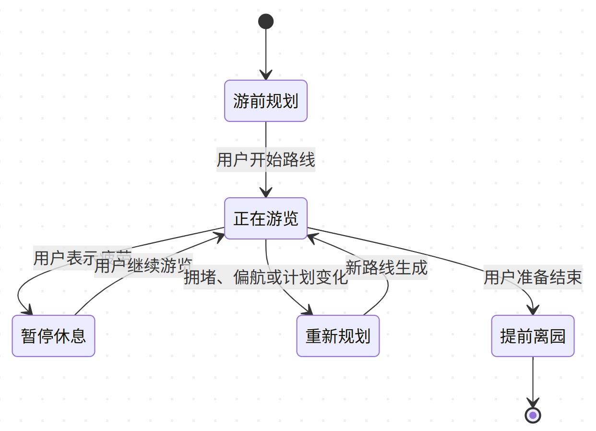

# 红山森林动物园智能游伴 Agent 模块二、三技术路线方案

> 覆盖范围：模块二“游前动态路线规划”与模块三“游中动态调整（管理预期 \+ 调整节奏）”  
> 
> 文档目标：清晰说明系统如何接收游客需求、计算游览路线，并在游览状态发生变化后动态调整剩余行程。
> 
> 

---

## **一、技术路线概述**

系统采用“**大模型理解与表达 \+ 确定性程序调度 \+ 路线优化算法计算**”的混合架构：

- **Qwen大模型**负责理解游客自然语言，将“带娃、不想爬山、想看灵长类”等需求转换为结构化参数，并负责解释路线与调整原因。

- **确定性Orchestrator**负责判断当前处于游前还是游中、按照预设规则调度各Agent和工具、维护游览状态。

- **园区路网与路线算法**负责实际计算场馆之间的通行路径、选择需要参观的场馆及访问顺序。

- **FastAPI后端**负责接收小程序请求、调用各模块，并将结果返回小程序。


核心原则是：**不让大模型凭语言能力直接编造路线，而是让大模型调用经过校验的路线规划工具。**


## **二、核心技术组件**

|技术或组件|作用|
|---|---|
|**微信小程序**|面向游客的交互界面，负责收集偏好、展示地图、路线和动态提醒。|
|**FastAPI**|Python后端开发框架，负责接收小程序请求，调用Agent、路线算法和数据库，并将结果返回小程序。|
|**Qwen**|大语言模型，负责自然语言理解、结构化信息提取、工具选择和面向游客的自然语言解释。|
|**FunASR**|语音识别工具，将游客语音转换成文字，再交给Intent Agent理解。|
|**确定性Orchestrator**|系统总调度器，使用Python规则或状态机，决定何时调用哪个Agent和工具。|
|**NetworkX**|Python图计算库，用于存储动物园道路网络以及调用最短路径算法。|
|**Dijkstra算法**|根据道路长度、坡度、遮阴、拥堵等代价，计算两个地点之间综合代价最低的通行路径。|
|**OR\-Tools**|Google开源运筹优化工具，用于在时间、体力、开放时间等约束下选择场馆并确定访问顺序。|
|**启发式算法**|通过贪心插入、2\-opt等快速规则生成较优路线，适合 MVP 快速实现。|
|**Redis/数据库**|保存本次游览Session、当前路线、已访问场馆和园区实时状态。MVP阶段可先使用内存或SQLite。|
|**微信地图/高德地图**|负责地图底图、定位和路线可视化；园区内部个性化算路主要使用自建园区路网。|

## **三、Agent与Orchestrator设计**

### **3\.1 Agent如何实现**

三个Agent不需要分别训练三个大模型，可以共同使用Qwen，通过不同的系统提示词、工具权限和输出格式形成角色分工。

|Agent|主要职责|可调用能力|结构化输出|
|---|---|---|---|
|**Intent Agent**|理解游客表单、文字或语音中的需求与变化|FunASR、参数校验|\`VisitorIntent\`或\`VisitEvent\`|
|**Route Agent**|将结构化需求转换为路线规划参数，调用算法并校验路线|园区状态查询、NetworkX、路线优化器、路线校验器|\`RoutePlan\`|
|**Dynamic Adjust Agent**|根据用户事件和实时数据判断是否调整，并生成调整策略|Session查询、附近设施查询、客流查询、重新规划工具|\`AdjustmentDecision\`<br>|

Agent可使用以下现有工具搭建：

- **Qwen\-Agent**：适合使用Qwen进行Function Calling和工具调用；

- **AgentScope**：适合需要明确展示路由、handoff和多Agent协作的场景；

- **LangGraph**：适合使用状态图管理游前、游中、暂停、重规划和离园等流程；

- **阿里云百炼工作流**：适合快速搭建可视化Demo；

- **自研Python状态机**：依赖少、流程可控，最适合MVP。

本项目推荐：**FastAPI \+ Python状态机 \+ Qwen Function Calling**。如果后续流程明显变复杂，再迁移到LangGraph或AgentScope。

### **3\.2 确定性Orchestrator**

Orchestrator根据明确规则调度系统，而不是让大模型自由决定全部流程。相同输入和相同状态下，应执行相同的业务分支。



典型调度规则：

|当前状态或事件|Orchestrator执行动作|
|---|---|
|游前提交偏好|调用Intent Agent，再调用Route Agent生成完整路线|
|用户说“累了”|更新体力状态，查询附近休息点，必要时重算剩余路线|
|用户说“饿了”|查询营业中的餐饮点，插入用餐节点并重算后续路线|
|用户想提前离园|锁定当前地点和出口，生成最优离园路线|
|场馆严重拥堵|比较继续等待、先逛附近场馆和跳过场馆三种方案|
|动物活跃事件|判断用户兴趣、绕行成本和场馆承载量，再决定是否推荐|
|用户偏离原路线|将当前位置匹配到园区道路，重新计算到下一节点的路径|

## **四、基础数据准备**

### **4\.1 园区路网**

将动物园导览图转换为可计算的图结构：

\- **节点**：入口、出口、场馆、道路交叉口、休息区、餐饮点、洗手间等；

\- **边**：节点之间可通行的园路；

\- **道路属性**：距离、步行时间、坡度、遮阴率、台阶、无障碍情况、拥挤系数、开放状态。


### **4\.2 场馆数据**

每个场馆至少需要保存：

- 场馆名称和坐标；

- 动物类别；

- 建议停留时间；

- 开放时间；

- 历史活跃时段；

- 亲子友好程度；

- 无障碍与婴儿车通行情况；

- 场馆容量和当前拥堵程度；

- 是否处于休息、医疗或不宜打扰状态。

### **4\.3 用户结构化需求**

Intent Agent将用户输入转换为统一格式：

```JSON
{
  "duration_minutes": 120,
  "pace": "slow",
  "avoid_climbing": true,
  "avoid_sun": true,
  "with_child": true,
  "preferred_animals": ["灵长类"],
  "must_visit": [],
  "avoid_pois": [],
  "accessibility": {
    "wheelchair": false,
    "stroller": true
  }
}
```

## **五、模块二：游前动态路线规划**

### **5\.1 输入**

- 游客可用时间；

- 体力与游览节奏；

- 怕晒、不想爬山等偏好；

- 动物类别偏好；

- 带娃、婴儿车、轮椅等特殊需求；

- 入口、出口和预计开始时间；

- 场馆开放、客流和动物活跃状态。

### **5\.2 处理流程**


### **5\.3 硬约束与软偏好**

|类型|示例|算法处理|
|---|---|---|
|硬约束|只能游览2小时|路线总时间不得超过|
|硬约束|轮椅通行|删除不可通行道路|
|硬约束|必须参观或避开某场馆|强制加入或删除候选场馆|
|硬约束|场馆关闭|不允许加入路线|
|软偏好|不想爬山|增加上坡道路的代价|
|软偏好|怕晒|增加无遮阴道路的代价|
|软偏好|喜欢灵长类|提高相应场馆推荐得分|
|软偏好|带娃、慢节奏|增加休息时间和亲子场馆权重|

### **5\.4 Dijkstra与路线成本**

Dijkstra用于计算任意两个地点之间的最佳通行路径。“最佳”不一定只是距离最短，可以综合考虑：

```Python
道路代价 = 步行时间 + 上坡惩罚 + 暴晒惩罚 + 拥堵惩罚
```

例如，一条道路虽然距离更长，但坡度小、遮阴好，可能更适合怕晒且不想爬山的游客。

Dijkstra主要解决“**两个地点之间怎么走**”，并为后续完整路线规划提供场馆间通行时间矩阵。

### **5\.5 OR\-Tools与启发式算法**

路线优化器解决“**选择哪些场馆，以及按什么顺序访问**”的问题。

输入包括：

- 候选场馆及推荐得分；

- 场馆建议停留时间；

- Dijkstra计算出的场馆间通行时间；

- 用户时间预算；

- 必去、避开、开放时间、无障碍等约束。

输出为完整访问顺序，例如：

```Plain Text
北门 → 亚洲灵长馆 → 本土动物区 → 熊猫馆 → 北门
```

MVP建议先采用：

1. 贪心插入：优先加入“体验收益高、额外耗时少”的场馆；

2. 2\-opt：交换部分场馆顺序，减少绕路和折返；

3. 后续再升级为OR\-Tools，以支持更复杂约束。

### **5\.6 模块二输出**

- 推荐开始时间和预计结束时间；

- 场馆访问顺序；

- 场馆间实际通行路径；

- 每个场馆预计到达与停留时间；

- 总步行距离、预计爬升和体力等级；

- 休息区、餐饮点和洗手间；

- 个性化推荐理由；

- 可选的“省力优先、兴趣优先、平衡方案”。

## **六、模块三：游中动态调整**

### **6\.1 游览Session**

系统为每次游览维护一个Session，记录：

```JSON
{
  "phase": "IN_VISIT",
  "current_location": "亚洲灵长馆",
  "current_time": "10:35",
  "visited_pois": ["冈瓦纳", "亚洲灵长馆"],
  "remaining_minutes": 75,
  "fatigue_level": "slightly_tired",
  "current_route": ["熊猫馆", "本土动物区", "北门"],
  "last_replan_time": "10:20"
}
```

定位与轨迹默认只服务于本次游览，避免不必要地长期保存游客位置数据。

### **6\.2 动态调整触发来源**

|触发来源|示例|
|---|---|
|用户主动输入|累了、饿了、想提前离园、想多待一会儿|
|位置变化|偏离路线、错过路口、长时间停留|
|时间变化|游览进度明显提前或延后|
|场馆状态|拥堵、关闭、道路临时封闭|
|动物状态|实时观察到活跃、历史预测活跃或正在休息|
|环境状态|降雨、高温等天气变化|

### **6\.3 动态调整流程**


### **6\.4 局部重规划**

动态调整时不重新推翻全部计划，而是固定：

- 已访问场馆；

- 当前时间和位置；

- 用户明确要求保留的场馆；

- 必须预留的离园时间。

系统只重新计算剩余路线，并增加“改动成本”，避免路线频繁跳动。

```Python
新路线评价 = 游览体验收益 - 通行成本 - 路线改动成本
```

### **6\.5 典型场景处理**

|场景|系统动作|
|---|---|
|用户走累了|插入最近休息点、降低步速、删除低性价比场馆|
|用户饿了|查询营业中的餐饮点，比较距离和拥堵，插入用餐节点|
|用户想提前结束|规划到出口的最优路径，并推荐沿途可顺路经过的场馆|
|用户在某馆多停留|更新剩余时间，压缩或跳过后续低优先级场馆|
|某场馆拥堵|比较继续等待、先逛附近场馆和跳过三种方案|
|动物当前活跃|综合用户兴趣、绕行时间和场馆容量后决定是否推荐|
|动物正在休息|降低当前推荐权重，建议稍后再来或选择替代场馆|

### **6\.6 防止频繁调整**

系统采用事件驱动，而不是每次GPS变化都重新规划。需要设置：

- 拥堵触发阈值；

- 偏航距离阈值；

- 重规划冷却时间；

- 路线变化收益阈值；

- 同类通知合并；

- 重大调整前的用户确认。

## **七、管理预期设计**

每次路线调整都需要向游客说明：

1. 发生了什么；

2. 对原计划有什么影响；

3. 系统提供哪些选择；

4. 每种选择需要付出什么代价。

例如：

> 熊猫馆当前预计等待25～35分钟。如果先去旁边的本土动物区，约40分钟后返回，预计可以少等15分钟，但路线会多走约300米。是否调整？
> 
> 

系统还需要区分不同可信度的信息：

|信息来源|推荐表达|
|---|---|
|传感器或饲养员实时上报|“10分钟前观察到长臂猿正在活动”|
|历史行为规律预测|“根据历史记录，这一时段通常比较活跃”|
|缺少可靠数据|“无法保证看到，可以将这里作为顺路探索点”|

不得将预测结果表述为确定事实，也不能承诺游客一定能看到动物。

## **八、动物福利与绿色发展约束**

动物福利要求应进入路线算法，而不只是出现在讲解文案中：

- 设置场馆最大推荐容量；

- 对拥挤场馆增加路线惩罚；

- 对医疗、喂养、休息和不宜打扰状态进行强制屏蔽；

- 对动物活跃推送设置频率限制；

- 为相似用户生成略有差异的路线，避免游客集中；

- 在体验收益与动物福利冲突时，优先保证动物福利。

系统目标不是帮助游客“不惜代价看到动物”，而是在动物福利边界内提供更省力、更合理的游览体验。

## **九、后端接口设计**

|接口|作用|
|---|---|
|`POST /api/route/plan`|根据游客需求生成游前路线|
|`POST /api/route/replan`|根据当前位置和剩余时间重新规划|
|`GET /api/park/status`|查询场馆开放、拥堵和动物状态|
|`POST /api/session/start`|创建本次游览Session|
|`POST /api/session/event`|上报疲劳、饥饿、偏航等游中事件|
|`GET /api/session/{id}`|获取当前路线和游览状态|

小程序、Agent和路线算法之间统一使用JSON格式传递数据，减少模块之间的耦合。

## **十、MVP实施方案**

### **第一阶段：数据与静态路线**

- 整理20～40个核心场馆和设施；

- 根据园区导览图绘制道路节点和边；

- 标注距离、坡度、遮阴和无障碍属性；

- 使用NetworkX和Dijkstra计算园内通行路径；

- 实现表单输入和静态路线展示。

### **第二阶段：个性化路线**

- 实现硬约束与软偏好；

- 使用贪心插入和2\-opt生成场馆访问顺序；

- 接入Qwen完成自然语言需求提取和路线解释；

- 输出省力、兴趣、平衡三类路线。

### **第三阶段：游中动态调整**

- 建立游览Session；

- 实现“累了、饿了、提前离园、多停留”四类主动调整；

- 使用模拟数据实现拥堵和动物活跃事件；

- 重新规划剩余路线并解释变化。

### **第四阶段：增强能力**

- 接入真实园区客流和运营数据；

- 使用OR\-Tools处理复杂约束；

- 增加客流短期预测和动物活跃度预测；

- 增加GPS道路匹配和iBeacon辅助定位。

## **十一、MVP推荐技术栈**

|层级|推荐选型|
|---|---|
|前端|微信小程序或Taro|
|后端|Python \+ FastAPI|
|基础模型|Qwen|
|语音识别|FunASR|
|Orchestrator|Python状态机，后期可升级LangGraph或AgentScope|
|园区路网|GeoJSON \+ NetworkX|
|最短路径|Dijkstra|
|路线优化|贪心插入 \+ 2\-opt，后期升级OR\-Tools|
|Session存储|MVP使用内存/SQLite，后期使用Redis|
|地图展示|微信地图组件 \+ 自定义Polyline|
|部署|阿里云|

## **十二、最终技术闭环**


整个方案中：

- **FastAPI负责接收和返回请求；**

- **Orchestrator负责安排处理流程；**

- **Intent Agent负责理解需求；**

- **Dijkstra负责计算两点之间怎么走；**

- **OR\-Tools或启发式算法负责选择去哪些场馆及访问顺序；**

- **Route Agent负责组织并调用上述路线工具；**

- **Dynamic Adjust Agent负责判断游中变化并发起局部重规划；**

- **Qwen负责自然语言理解、工具调用和结果解释。**

由此形成“**游前个性化规划—游中状态感知—剩余路线调整—预期管理—完成游览**”的完整技术闭环。


